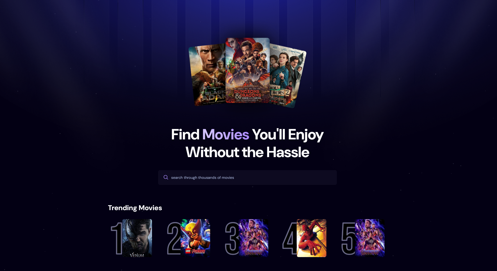
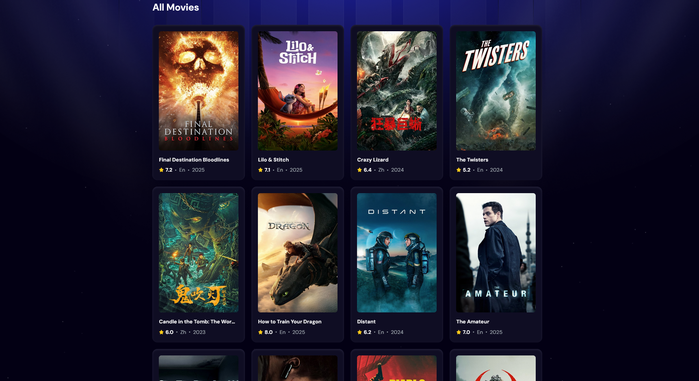
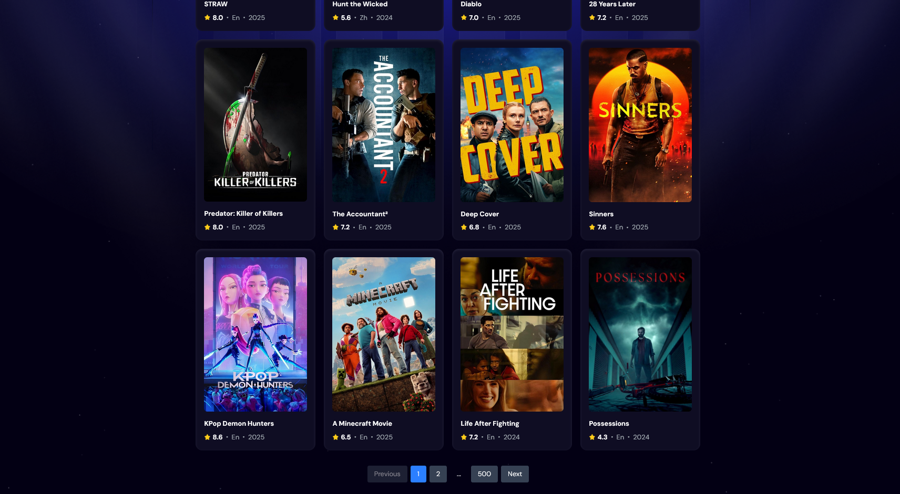
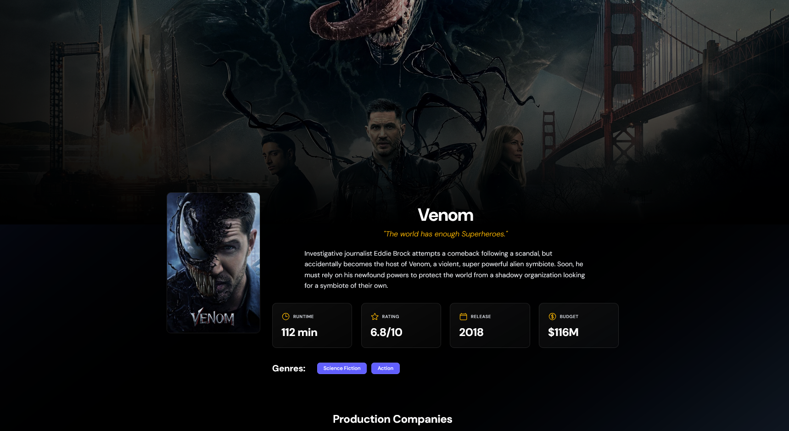
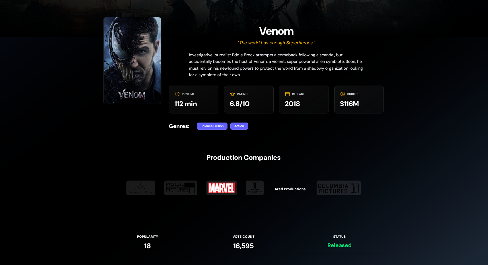
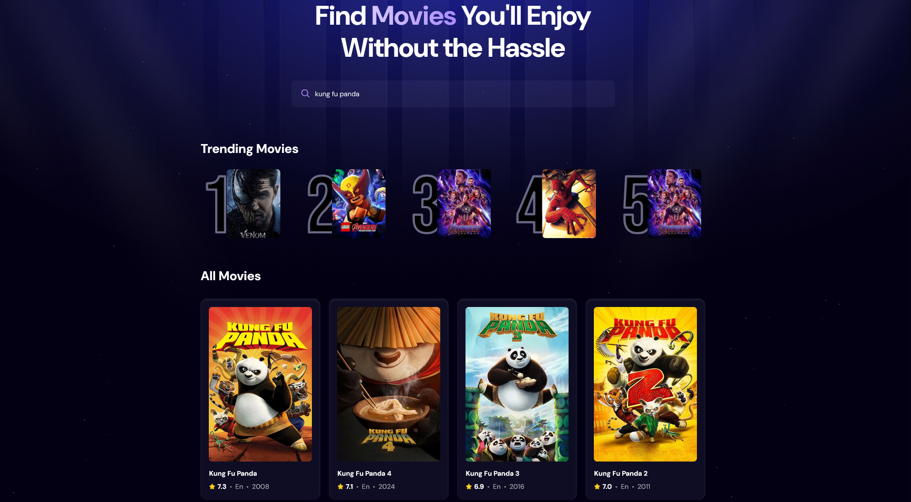

# Movie Finder App








This is a React-based movie finder application that allows users to search for movies, view trending movies, and update trending movie metrics. The app integrates with The Movie Database (TMDB) API for movie data and uses MongoDB to store trending movie metrics.

## Features

- **Search Movies**: Users can search for movies by title.
- **Trending Movies**: Displays the top 5 trending movies based on search counts.
- **Update Trending Metrics**: Automatically updates trending metrics when a movie is searched.

## Setup

### Prerequisites

- Node.js and npm installed.
- Python 3.9 or later installed.
- MongoDB database (local or cloud).
- TMDB API key.

### Installation

1. Install dependencies:
   ```bash
   npm install
   ```

2. Create a `.env` file in the root directory with the following variables:
   ```env
   VITE_TMDB_API_KEY=your_tmdb_api_key
   VITE_TRENDING_API_URL=http://localhost:8000
   MONGO_DB_URL=your_mongodb_url
   ```

3. Install backend dependencies:
   ```bash
   cd backend
   pip install -r requirements.txt
   ```

4. Start the FastAPI backend server:
   ```bash
   uvicorn main:app --reload
   ```

5. Start the React development server:
   ```bash
   npm run dev
   ```

6. Open your browser and navigate to `http://localhost:5173` to view the app.

## Project Structure

- **`src/`**: Contains the React frontend code.
  - **`App.jsx`**: Main application component.
  - **`components/`**: Reusable components like `Search`, `MovieCard`, and `Spinner`.
- **`backend/`**: Contains the FastAPI backend code.
  - **`main.py`**: FastAPI application with routes for trending movies.
  - **`database.py`**: Handles MongoDB connection and operations.
  - **`movie_repository.py`**: Contains methods for fetching and updating trending movies.

## Usage

1. **Search for Movies**: Enter a movie title in the search bar to find movies.
2. **View Trending Movies**: The top 5 trending movies are displayed based on search counts.
3. **Update Trending Metrics**: When a movie is searched, its trending metrics are updated in the database.

## Technologies Used

- **Frontend**: React, Tailwind CSS
- **Backend**: FastAPI
- **Database**: MongoDB
- **API**: The Movie Database (TMDB)


